I am currently using standard Brushless DC (BLDC) control which uses a 6 step method of controlling
the motor. However, there is a different method of control called Field Oriented Control (FOC) which
is more efficient and gives maximum torque. If you want less theory and a post about setting this up
on a VESC controller, go to [VESC FOC setup](/vesc-foc).

### BLDC operation ⚙️

A BLDC motor is a bit of a misnomer because it's operating principle is closer to that of an AC motor
than a DC motor. The reason it is called a DC motor is because the controller usually takes in a DC
power source, so it looks to be running on DC from the end user's point of view.

It is constructed of usually a multiple of 3 coils where each multiple corresponds to a different 
phase wire. As seen in Fig 1.1 the three phases are 120 degrees out of phase with each other. Fig 1.1
is a simplified version of a BLDC motor because the coils can only be on or off.

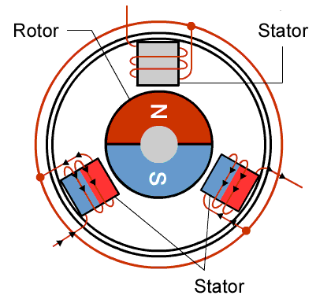

*__Fig 1.1__ A simple binary version of a BLDC motor*

A more realistic model of the BLDC motor has three sinusoidal waveforms (seen in Fig 1.2) for each phase 
instead of square waveforms as seen in Fig 1.1. Once these 3 phases are applied to the motor, it should
rotate at a frequency equal to the frequency of the sine waves divided by the number of multiples of phases.
So the example in Fig 1.1 would rotate at the same frequency because it has one multiple of coils.

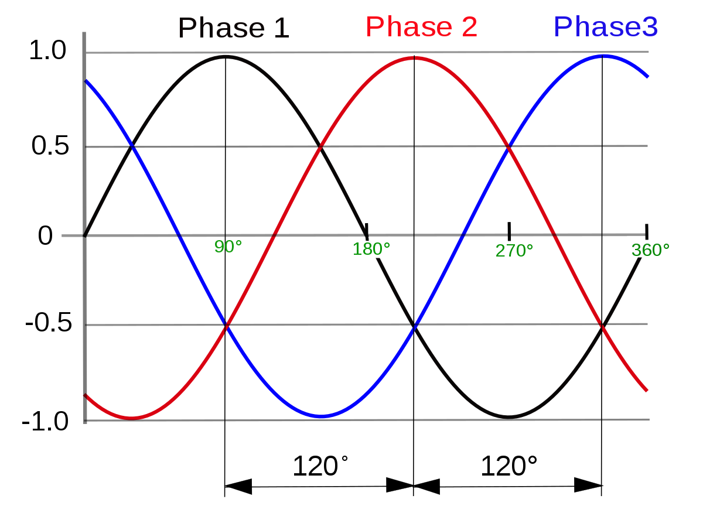

*__Fig 1.2__ The ideal phase voltages of a BLDC *

### Sensored vs sensorless 🔬

When applying the control signals to the motor, it is very important to know the position of the motor,
since the phase of the sine wave is dependent on the exact position of the rotor. There are two methods
of position measurement 1) sensored and 2) sensorless.

##### 1. Sensored

Usually hall effect sensors are used to monitor how the permanent magnets of the rotor are oriented with
regards to the stator. This gives very accurate phase information even when the rotor is stationary. Hall effect
sensors measure magnetic fields through the hall effect and convert this measurment to some kind of signal. The
sensors used in BLDC motors are usually latching sensors, which means that they have a HIGH impedance output when 
it detects a North/South pole and a LOW impedance output when the opposite pole is sensed. 

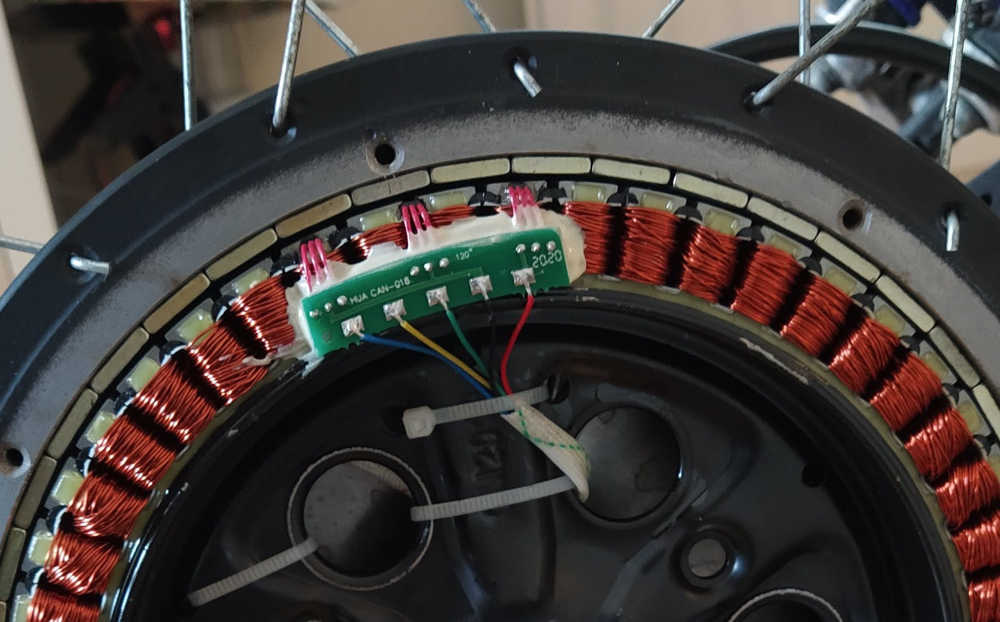

*__Fig 2.1__ The hall sensors that are in my hub motor *

The three sensors are each placed at one of the phase wires. Therefore, three square waves are produced as the motor
rotates, which are 120 degrees out of phase with each other (as seen in Fig 2.2). These signals are used to
determine the rough position of the motor.

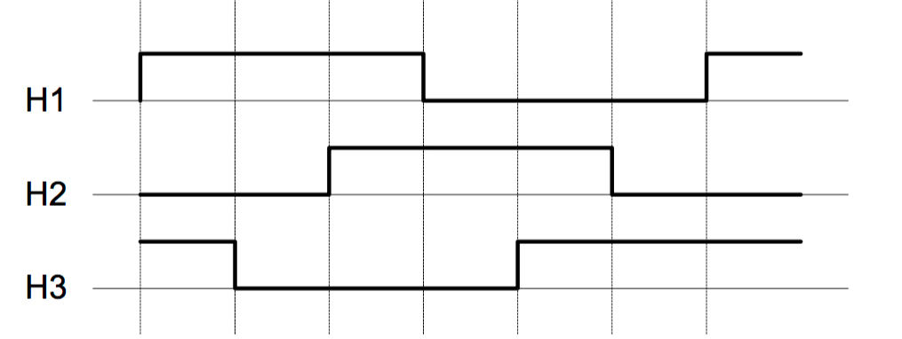

*__Fig 2.2__ The hall sensor outputs as the motor rotates *

##### 2. Sensorless

Sensorless sensing uses the voltage induced in the windings by the permanent magnets to estimate the 
motor's position. This voltage is a result of Back ElectroMotive Force (BEMF). According to faraday's
law, a changing magnetic field induces a voltage in a coil. Two of the three phases of the motor are
driven, while the other phase is not driven but instead used to measure this back EMF as seen in Fig
2.3. The BEMF is at zero when the magnetic field is aligned with the coil. Therefore, a simple zero
crossing detector can be used to detect the alignment of the motor.

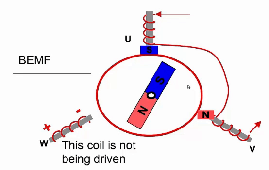

*__Fig 2.3__ Sensorless operation of a BLDC motor *

This method of position sensing has some drawbacks however. Firstly, it requires a control method
similar to trapezoidal control, which is not a very efficient control method. One of the phases cannot
be driven for a period, which reduces the maximum torque output of the motor. Secondly, the motor
cannot sense its position without moving. Therefore, when the motor is stationary, the motor has to
either move in a random direction to figure out it's initial position, or activate one of the coils until
the motor aligns to that coil's position.

### 6 step trapezoidal control 📈

Trapezoidal control is one of the simplest control methods for BLDC motors. This control method has 6
discrete voltage steps as seen in Fig 3.1. There are three voltage levels 1) battery negative 2) battery
positive and 3) floating. It is at the floating voltage level that BEMF can be measured for position
estimation if sensorless commutation is being used. 

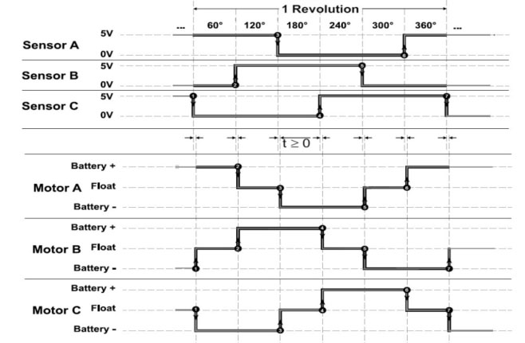

*__Fig 3.1__ The output of each of the 6 phases of trapezoidal control *

This control method is not ideal however because the torque is not always perpendicular to the magnetic 
field and the signal should ideally be sinusoidal. FOC is needed for this type of control, but that is 
explained in the next section. This form of control acts like carrots being placed in front of a
character, as seen in Fig 3.2. When the character reaches the carrot, another carrot is placed in front
of them. This leads to a choppy motion if the speed of the character is proportional to its distance
from the carrot.

*__Fig 3.2__ Carrot method has variable speed*

### FOC control 🌊

Field Oriented Control (FOC) attempts to create the optimal control signal for a motor. The previous
example of carrots being placed in front of a character is improved by placing the carrot at a fixed
distance at all time, as seen in Fig 4.1. The distance from the character is constant and optimally
far away so that it moves smoothly and most efficiently 😄 

*__Fig 4.1__ Carrot on stick method has constant speed*

##### Direct and quadrature axes

But it's not really that simple 😅 Firstly, let's look at the magnetic fields inside the motor. The
stator is the stationary part of the motor (which is where the coils are, which are controlled by
the motor controller) and the rotor is the rotating part of the motor (which is where the permanent
magnets are housed). Fig 4.2 shows the magnetic fields of the rotor and stator. The rotor magnetic
field is created by the permanent magnets inside and therefore is constant and aligned with the
position of the rotor. The stator magnetic field is created by the controller, in this case it is
showing trapezoidal control. When using a 6 step trapezoidal control algorithm, the torque and
speed are not constant.

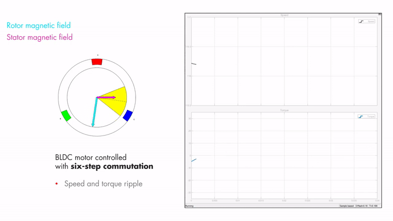

*__Fig 4.2__ A motor with 6 step control produces uneven torque and speed*

Maximum torque occurs when the two magnetic fields are orthogonal to each other, which is what FOC
tries to achieve. This can be seen in Fig 4.3.

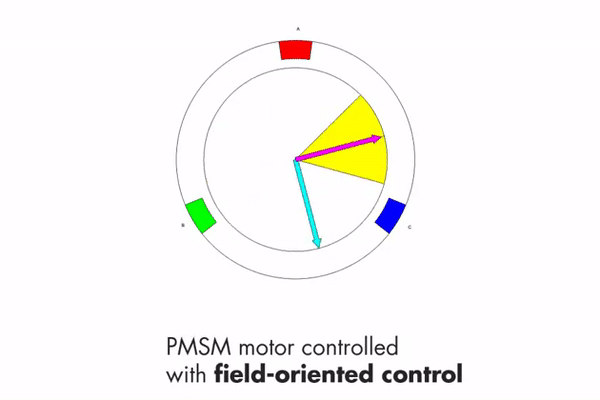

*__Fig 4.3__ The same motor using FOC which gives maximum torque*

It is also important to introduce two other vectors at this stage. 1) The direct vector and 2) the
quadrature vector. The direct vector (denoted by d) is the component of the stator magnetic field 
that is inline with the rotor magnetic field. The quadrature vector (denoted by q) is the component 
of the stator magnetic field that is orthogonal to the rotor magnetic field. These two vectors can
be seen in Fig 4.4. The goal is to maximise the length of the quadrature vector and minimise the
length of the direct vector.

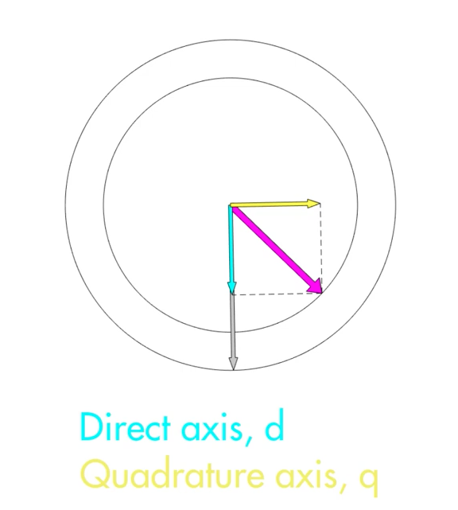

*__Fig 4.4__ The direct and quadrature vectors*

*These figures have been taken from a YouTube series by Matlab with an episode on FOC at:
https://www.youtube.com/watch?v=YPD1_rcXBIE*

##### 3 phase signals to components

Now obviously the controller doesn't output the direct and quadrature components 😅 The controller
works with a 3 phase output. It can be difficult to control these three signals with traditional
PID methods however. Therefore, a transform is used to determine the 3 phase outputs for particular
values of the direct and quadrature components.

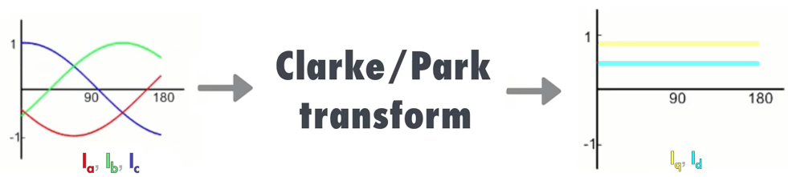

*__Fig 4.5__ The purpose of the Park and Clarke transforms*

##### Clarke transform

The Clarke transform changes the basis of the three phases ABC to a new basis XYZ. These new bases
are used to project the 3 phases to the 2 control vectors (quadrature and direct).

To start, it is important to understand how the ABC bases are represented. The traditional
representation is composed of a 2D image with the ABC bases rotated 120 degrees apart. This is really
a projection of the ABC bases from a 3D model.

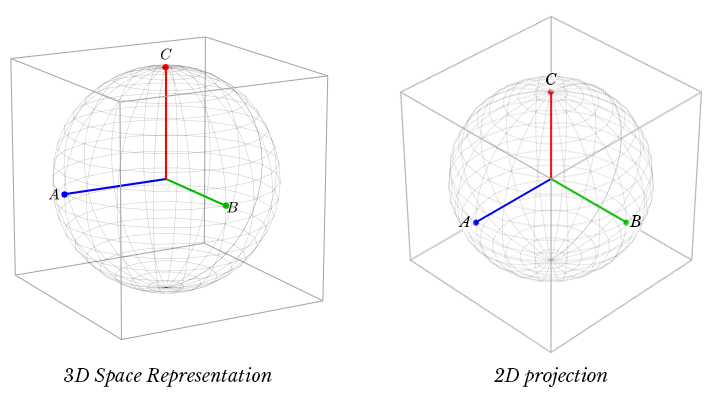

*__Fig 4.6__ A 3D representation and the traditional 2D representation of ABC*

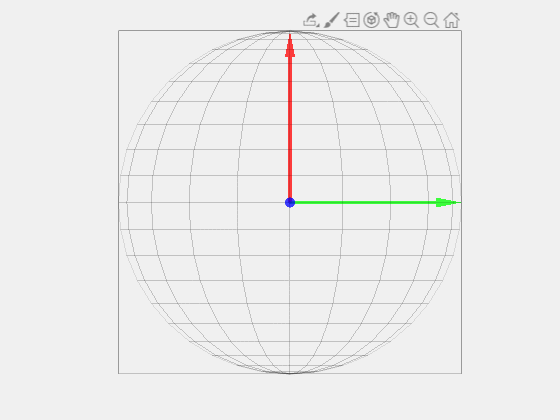

*__Fig 4.7__ An animation of the projection from 3D to 2D*

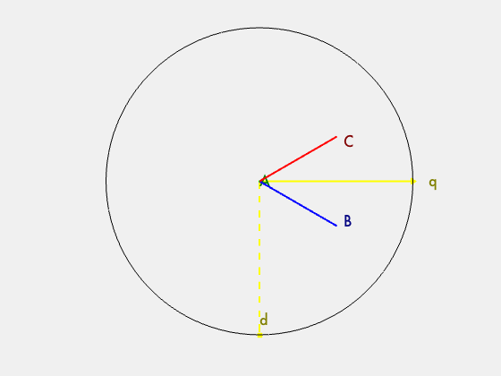

*__Fig 4.8__ An animation of the 2D projection*

Now that the ABC bases are represented, we can transform these bases into a set of bases that contain
a vector that is orthogonal to the projection. This collapses the 3D problem to a 2D problem. The Z axis
in the new XYZ basis is the common mode portion, which can be discarded. There are two simple
transformations that take place. 1) ABC is rotated around the A vector by 45 degrees. 2) The new bases
are rotated around the new Y axis. This creates the new XYZ bases.

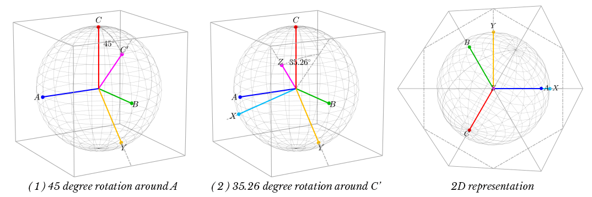

*__Fig 4.9__ The steps of the Clarke transform*

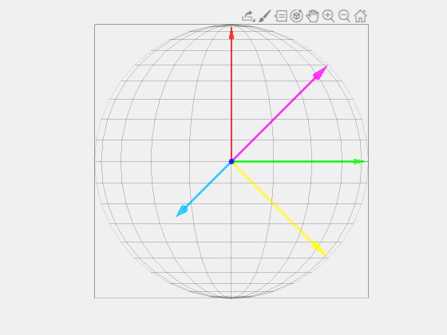

*__Fig 4.10__ An animation of the XYZ bases and original ABC bases*

And this is what the matrix form of the transformation looks like. The two matrix transformations that
were described before can be combined into one single matrix. That's the Clarke transform in a nutshell
and it is more difficult and important than the Park transform.

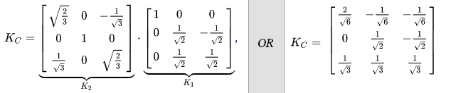

*__Fig 4.11__ The Clarke transformation matrix*

##### Park transform

Once the Clarke transform is performed, the Park transform can be applied. The Park transform by 
contrast to the Clarke transform is a piece of cake 🍰 In a sentence, "The Park transform is simply a 
clockwise rotation around the Z axis". The rotation angle ( θ ) is the estimated angle of the rotor
relative to the magnetic field being created.

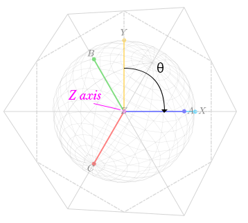

*__Fig 4.12__ The Park transformation*

And again, here is the matrix for said transformation. This transformation matrix can be combined
with the Clarke transformation in order to create the DQZ transform matrix.

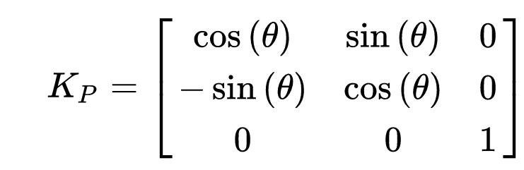

*__Fig 4.13__ The Park transformation matrix*

##### Basic FOC block diagram

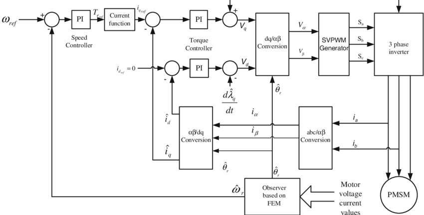

*__Fig 4.14__ The FOC block diagram*

Now that we have an idea of the transforms and reasoning behind FOC,
let's start by looking at the right of the diagram in Fig 4.14, where the 3 phase inverter and
motor are arranged. The phase currents from the motor are converted to the 2D bases using the
Clarke transformation. Then, the Park transformation is used to rotate the frame of reference to
that of the rotor. This rotor angle is estimated by an observer.

Now that the quadrature and direct currents are calculated, they are fed into two PID controllers.
The first controller tries to maintain the direct current at 0 because it does not create any
torque. The second controller controls the quadrature current using another PID controller to
monitor the speed.

The new phase voltages have been estimated and are converted from quadrature and direct voltages
to 3 phase voltages using the inverse Clarke and Park transformations. A PWM generator creates a
rough estimate of these voltages. The inverter then drives the motor and the cycle repeats.

### ENOUGH OF THE THEORY! 📚

For further reading about how to setup FOC on a VESC, look at this [link](/vesc-foc).
