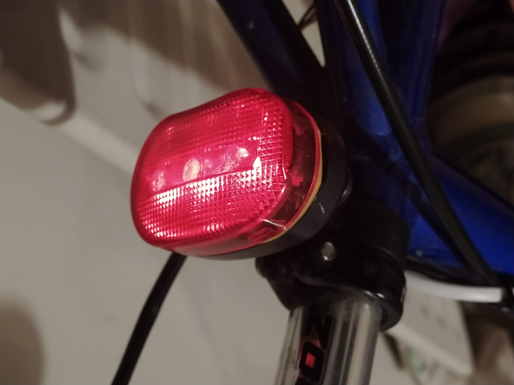
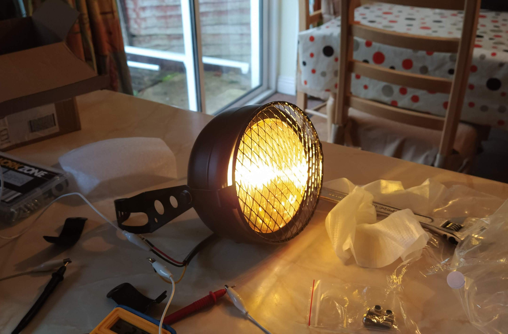
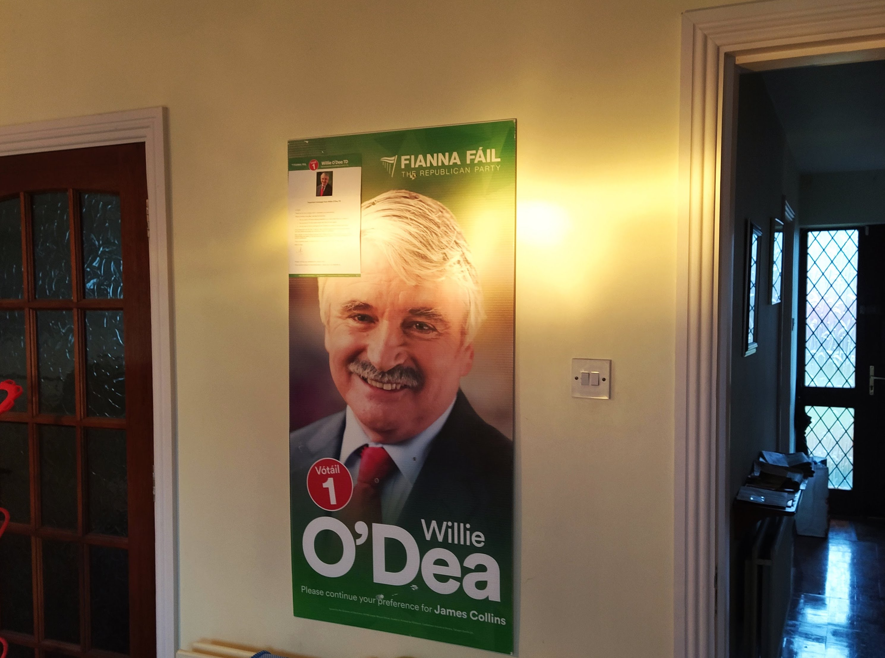
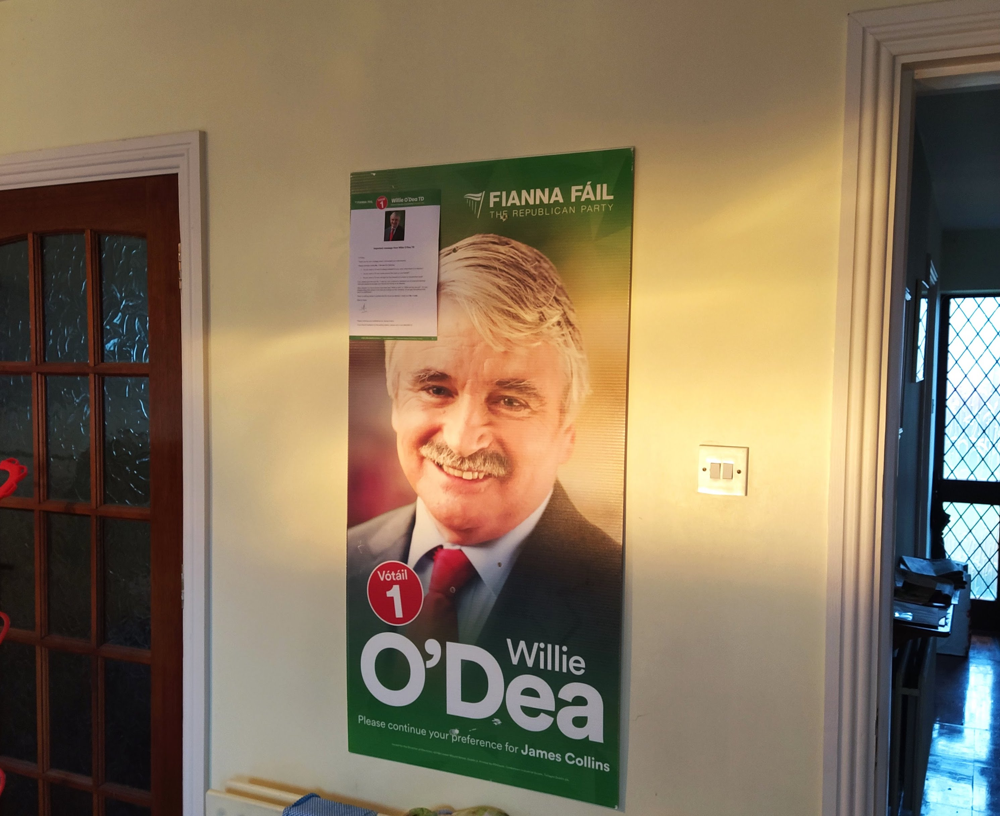
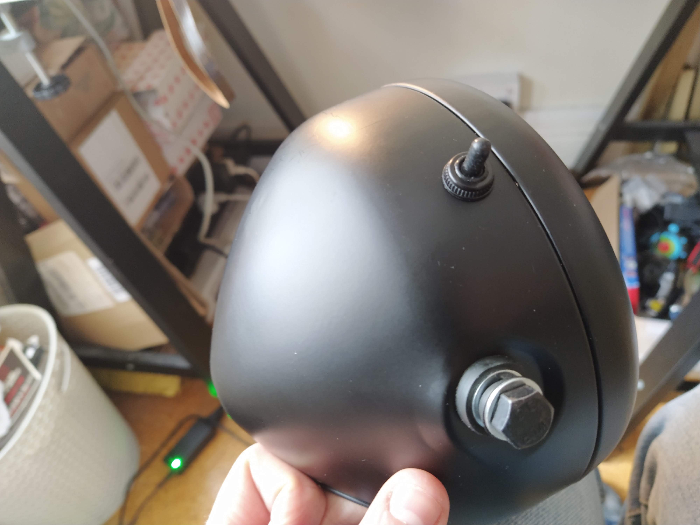
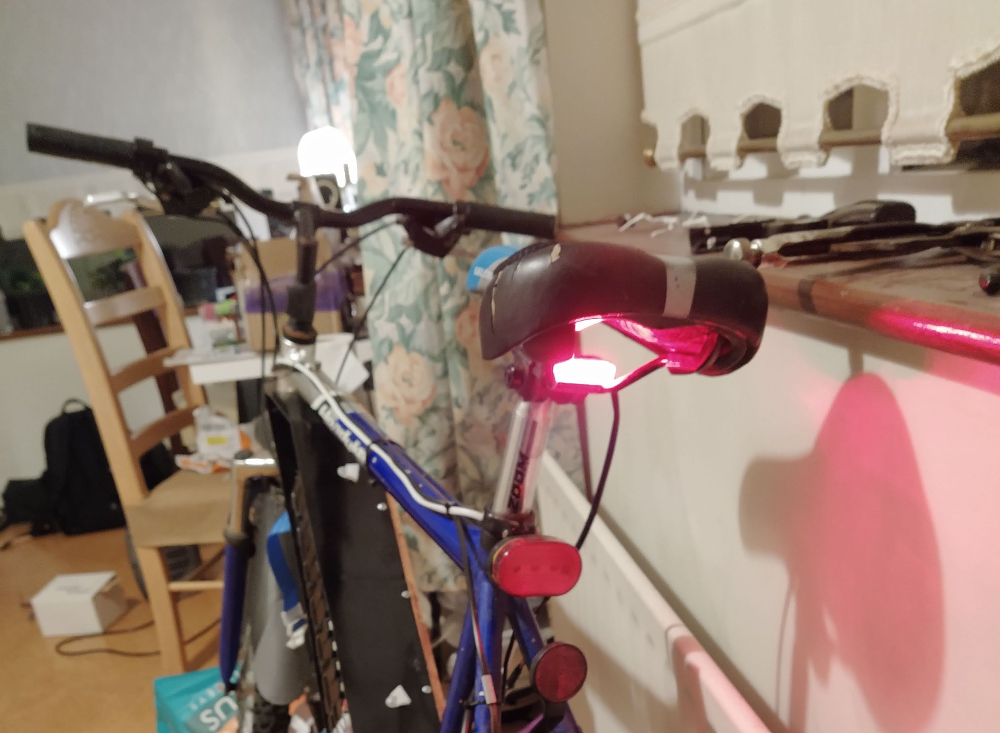
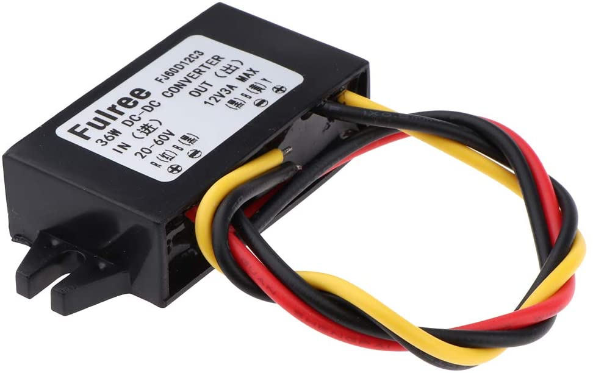
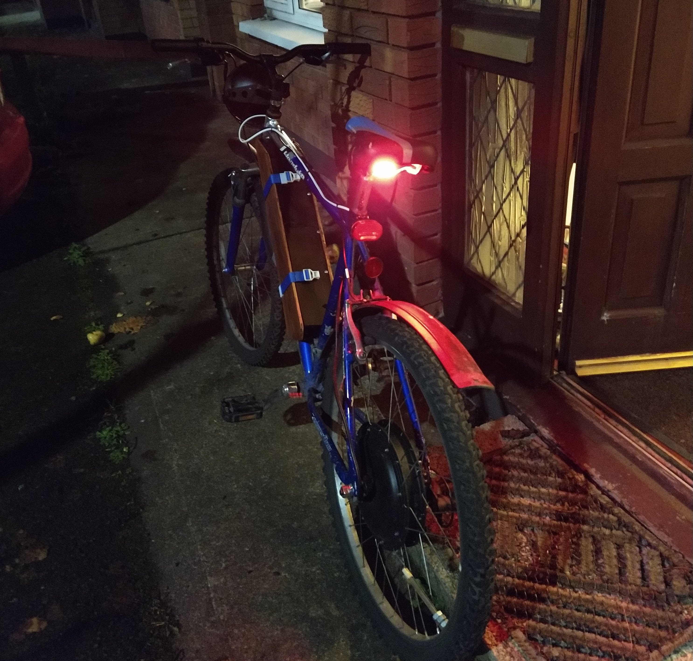
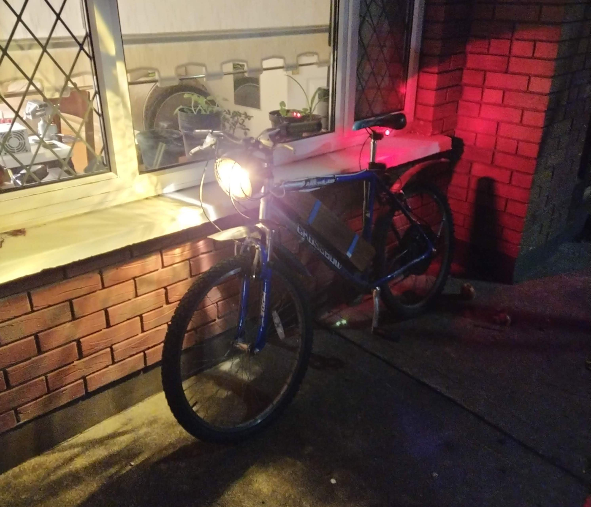

The old lights on my bike were just plain Jane bike lights from halfords. They are liable
to be easily stolen, run out of internal battery and they aren't very bright. I decided to
replace these lights with more substantial lights that run from the 50V battery.

*__Fig 0.1__ The old clip-on light *

### 1. Headlight 🤯 💡

I bought a headlight from banggood for €20 which is designed for a motorbike. It is a 35W bulb
which I measured to be 2.8A@12V = 33.6W. Furthermore, there are heads and dipped options.

*__Fig 1.1__ The new headlight *

*__Fig 1.2__ Heads mode*

*__Fig 1.3__ Dips mode*

I also had to make a few modifications to the headlight. 1) I added a switch to be able
to switch between heads, dips and off. The switch has an o-ring that seals against the
light. 2) The bracket that came with the light was designed for a motorbike which has
two downpipes on the front. I had to modify this to work with the single downpipe on my
bike.

*__Fig 1.4__ The added switch*

### 2. Rear light 🍑 💡

The new back light is a 12V LED red light. I just zip-tied it underneath the seat
so that it's protected from water and impacts.

*__Fig 2.1__ The new rear light*

### 3. 12V Regulator ⚡

I added a 12V 3A regulator that can regulate the ~50V battery. The device is an automotive
spec regulator. The reason I chose this regulator is because it was the cheapest one I
could find (€7.50). Car parts are some of the most affordable parts available because they have and
wide range of uses and they're made in large quantities.

*__Fig 3.1__ The 12V buck converter that regulates all 12V devices*

### 4. Final Product 😍

