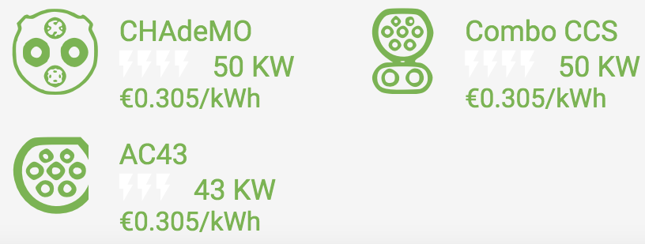

### Charging Connectors 🔌

There are a number of charging connectors 

The options for different types of connectors are as follows:

- AC or DC
    - Single or three phase (for AC)
- Speed of charge
- Extra control pins

The ESB in Ireland support three different types of connectors:

1. DC CHADEMO: (Nissan Leaf, Mitsubishi)
2. CCS COMBO: (BMW, Volkswagen, Hyundai)
3. AC 43: (Renault Zoe)

- Some also support Type 2 connectors

<div style={{ maxWidth: '800px', height: 'auto', margin: '0 auto' }}>



</div>

<div style={{ textAlign: 'center' }}>

*__Fig 1.1__ The three connectors supported by the ESB *

</div>

#### CHAdeMO

DC chargers can usually deliver more power than AC chargers. This is because
an onboard rectifier is not needed for DC charging because the rectifier is
in the charging station itself. 

```
Power:         400kW (DC)
Voltage:       Max 500V
Current        Max 125A
Communication: CAN
```

#### CCS Combo

"The CCS combines single-phase with rapid three-phase charging using alternating current at
a maximum of 43 kilowatts (kW), as well as direct-current charging at a maximum of 200 kW and the
future perspective of up to 350 kW – all in a single system." - taken from the CCS combo
specification 1.0 at: [spec 1.0](https://tesla.o.auroraobjects.eu/Combined_Charging_System_1_0_Specification_V1_2_1.pdf).

Charging modes:

**Mode 1:** 
- AC charging at normal mains outlets
- No protection devices in the charging cable
- RCD in domestic installations an essential prerequisite
- No energy feedback, no communications

**Mode 2:** 
- AC charging at normal mains outlets
- Charger cable with integrated safety devices in an in-cable
control box comprising RCD, control pilot and proximity
sensor
- Without energy feedback, signaling between the in-cable
control box and the electric vehicle is possible via the
control pilot

**Mode 3:** 
- AC charging at Type 1/2 charging stations
- Safety equipment is a permanent part of the charging
station, no in-cable control box required in the cable
- Type 2 plug interlock permits unsupervised operation, even
in a public space
- As opposed to modes 1 and 2, energy feedback is possible
via HLC, since communications are bidirectional
throughout, control is possible and plugs can be locked 

**Mode 4:** 
- DC charging at Combo 1/2 charging stations
- Charging system can manage various charging currents
and charging voltages to adopt various battery systems
- For charging control HLC is required
- *The charging station acts as an off-board charger*

```
Power:         Max 43kW (AC) / Max 350kW (DC)
Voltage:       Max 500V
Current        Max 125A
Communication: PWM / PLC
```

#### AC 43
