You definitely don't need to know how your engine works to perform most maintenance on it.
However, having an understanding of what you're working on helps to prevent doing unnecessary damage.

In this article I'm going to dissect an engine from the top down, stopping at points to explain
the theory of parts, with the aim of having a decent intuition on how your engine propels
your car down the road.

My case study of choice is going to be the Volkswagen group 1.8t engine as this is the engine
I'm currently working on in my [__2002 Audi TT__](https://www.mcand.ru/audi).

### 1. Engine Theory Basics

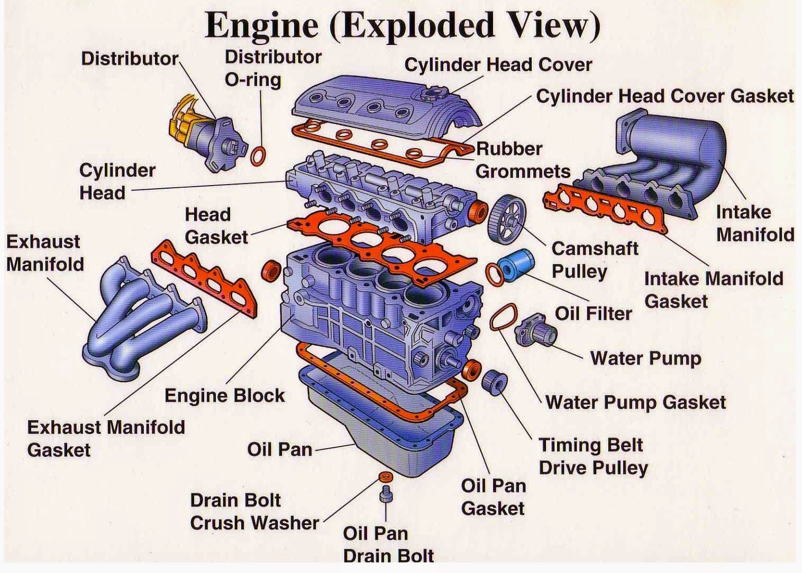

The basics of engine theory are out of the scope of this article. However, I would recommend
checking out [this video](https://www.youtube.com/watch?v=DKF5dKo_r_Y) for a really nice
visualisation of the basic principles of a combustion engine before giving this article a read.

### 2. Cylinder Head

The cylinder head is on top of the block. It contains all of the components that control the
air, fuel, ignition and exhaust of the combusted gasses from each of the cylinders.

#### 2.1 Camshafts

A camshaft dictates the behaviour of the engine. It controls when to open the valves, how long to keep 
them open for and how far to open them. It does this by attaching cam lobes on to the camshaft that
are placed over each valve. While this varies across engines, the 1.8t engine has a tappet at the top
of each valve. The cam lobe pushes down on the tappet, thus pushing the valve down to open it.

The shape of the cam lobe determines how long the valve is open for and how much it opens. Most cam
lobes have a taper so that they open and close progressively. The positioning of the cam lobes on the
camshaft determines when the valves open.

##### 2.1.1 Pushrods

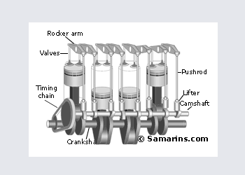

*__Fig 2.1__ Example of a Pushrod engine configuration*

Older engines, such as the family MGB, also with a 1.8 litre inline four cylinder engine, use pushrods 
rather than tappets to control the opening of the valves. Rather than the cam lobe pushing down on a
tappet, it pushes up on a lifter. The lifter is attached to a rushrod that pushes a rocker arm that in
turn pushes down the valve to open it. It is quite a round-about way of opening a valve. Lifters can
be solid, such as the lifters in the MGB, which ocasionally require adjustment to ensure that
the valve isn't staying slightly open or staying closed for too long. To prevent the need for adjustment,
hydraulic lifters were invented that contain pressurised oil and a spring inside which keeps pressure on
the rocker. This ensures that there is no gap between the rocker and the valve at all times.

##### 2.1.2 Overhead Camshafts

The camshafts in pushrod engines are typically beside the crankshaft rather than at the top of the head.
This is why the term __Overhead Cam__ came to be. Rather than a pushrod pushing a rocker at the top of
the engine, the need for a pushrod was removed by placing the camshaft at the top of the engine head instead.

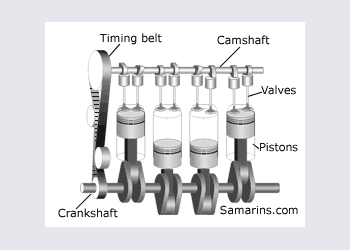

*__Fig 2.2__ Example of a Single Overhead Cam engine*

Originally, cars had a single camshaft for both intake and exhaust valves. However, as it became apparent
that adding more valves per cylinder was beneficial, 

The 1.8t engine has three intake valves and two exhaust valves per cylinder. The advantage of having
multiple valves per cylinder is that it increases the surface area for air to flow through, increasing
the intake capacity.

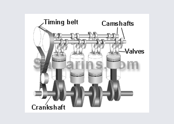

*__Fig 2.3__ Example of a Dual Overhead Cam engine*

The position of each camshaft must be in time with each other at all times so that combustion occurs
in the most efficient way possible. Any change in the timing of the engine can cause poor combustion
and if not addressed, can cause damage to the engines components.

#### 2.2 Spark

Spark plugs provide the spark needed to ignite the fuel in the cylinder. The spark must be generated
at the exact correct time when the air and fuel are mixed and compressed and in order for it to burn as clean
as possible. On older cars, a __distributor__ was mechanically connected to the intake cam shaft.

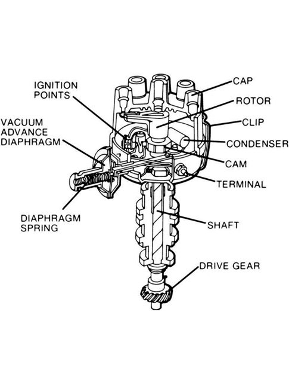

*__Fig 2.4__ Diagram of distributor that connects directly to camshaft*

Inside the distributor there is a rotor arm that spins with the cam shaft. As it rotates, it
directs high-tension current required to create a spark, through the high-tension lead connected to
the spark plug for the cylinder that is coming up on its compression stroke.

Most modern engines instead use a position sensor that sends the position of the intake cam shaft to the
ECU. The ECU in turn sends a signal to a __coil pack__ to generate the spark. The coil pack replaces a
coil within the distributor and are considered more reliable than a distributor because they are used
only to create the spark for a single cylinder rather than for all of the cylinders. There are also no
moving parts.

### 3. Timing

The __camshafts__ keep valves and sparks in time and the __crankshaft__ keeps the pistons in time. A timing belt
or chain keeps the crankshaft and camshafts in time with each other. Typically, on a DOHC engine, the chain
or belt is connected to gears on the end of the camshafts and to the gear at the end of the crankshaft.

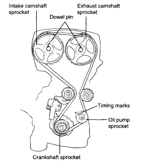

*__Fig 3.1__ Example of a typical inline DOHC timing chain configuration*

In classic Volkswagen fashion, 1.8t engine does something different. Each of the camshafts are kept in
time with each other with a timing chain on the far side of the engine and the camshafts are kept in
time with the crankshaft with a timing belt. Because the camshafts are in time with each other via the
cam chain, only one of the camshafts is connected to the crankshaft (the exhaust one). To be honest
I have absolutely no idea why Volkswagen decided to do this.

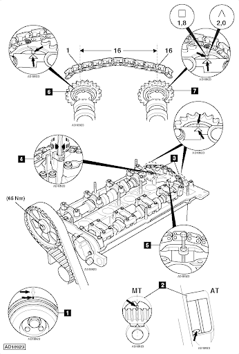

*__Fig 3.2__ VW 1.8T engine cam chain and timing belt configuration. Note the chain connecting the camshafts
on the right side of the engine and the timing belt connected to the exhaust camshaft on the left side.*

### 4. Manifolds

In a 4-cylinder inline engine there is typically a single intake and exhaust manifold. The intake manifold
takes air and distributes it to each of the 4 cylinders. The exhaust manifold collects exhaust gasses from
each of the 4 cylinders and collects the gasses out to the exhaust.

#### 4.1 Exhaust

The exhaust manifold consists of a runner for each cylinder that collect together. The manifold is then connected
to the downpipe of the exhaust.

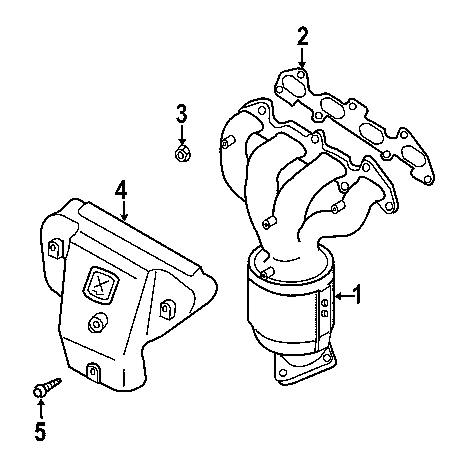

*__Fig 4.1__ Exhaust manifold*

Each runner must be of equal length. This is because, as the engine runs, it sends out exhaust pulses as combustion
occurs in each cylinder. This creates a force that helps to draw out the exhaust gasses for the next pulse, resulting
in better engine performance. If the runners were of different length, the drawing force would differ between cylinders,
resulting in poor performance.

#### 4.2 Intake

The intake manifold supplies the combustion mixture of fuel and air to each of the cylinders. It is important
that each cylinder gets and even distribution of the mixture for optimal engine performance.

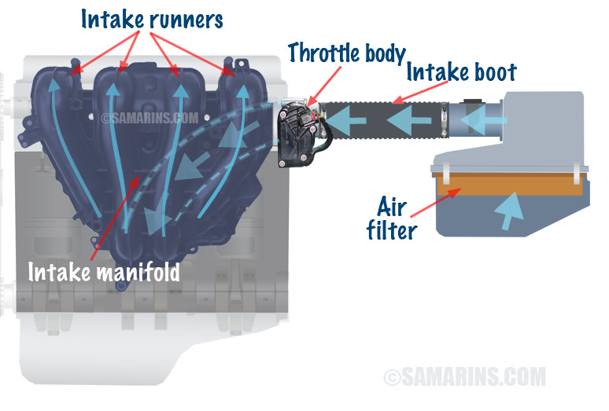

*__Fig 4.2__ Exhaust manifold*

Due to the downward movement of the pistons, a vacuum is created in the manifold that creates a significant 
air flow. In order for an even mix of the combustion mixture to enter each cylinder, the pressure in each
manifold runner must be equal. To achieve this, they must all be as close to equal in length and size as
possible.

The __vacuum__ created in the intake manifold can be used as a source of power for many auxilliary systems
such as to power the brake booster, turbo control and emission systems.

## 5. Fuel Injection

### 5.1 Carburetors

Older cars use carburetors to mix fuel and air before it enters the cylinders. A carburetor sits at the
end of the intake manifold. It takes in air, adds the fuel to it and before it is pushed into each cylinder.
The carburetor has a throttle and as it opens, the pressure within the carburetor drops and fuel is drawn
from a reservoir and sprayed into the air.

Carburetors also have a __choke__ that helps the engine to combust when it is cold. It works by blocking
the air intake so that the pressure within the carburetor is higher, which in turn draws out more fuel
from the reservoir.

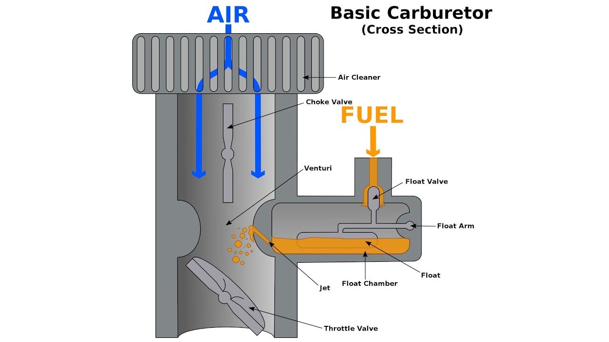

*__Fig 5.1__ Carburetor*

Pressurised air enters the
carburetor and is stopped by the throttle at the end of the carburetor. As the throttle

### 5.2 Port Injection

Carburetors are not a particularly precise method of injecting fuel and often cars use one
carburetor for multiple cylinders to save money. However, this results in little control
over the quantity of fuel in the cylinder.

Port injection uses an injector to spray fuel just before the intake valve. This allows
for better control over the fuel/air mixture going into each cylinder.

### 5.3 Direct Injection

Direct injection sprays fuel with an injector similar to port injection but instead of
spraying it before the cylinder, it sprays the fuel directly into the cylinder. This
allows for the fuel to mix better in the cylinder, resulting in a cleaner burn.

### 5.4 Hybrid Injection

From my understanding, european 1.8T engines use port injection when starting the car
and switch to direct injection when the engine comes up to temperature. This is because
injecting fuel at the port cleans the valves of carbon which is great for the
longevity of the engine. However, to achieve better fuel economy, direct injection is
used once the engine has come to temperature.

## 6 Crankshaft

The pistons are connected to the crankshaft. As the pistons move, the crankshaft rotates.
The crankshaft is connected to the gearbox and provides propulsion for the car.

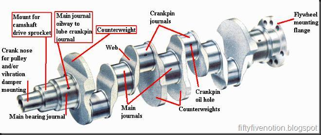

*__Fig 6.1__ Crankshaft*

Each piston is connected to a journal via a connecting rod attached to the piston.
When the cylinders fire, they create pulses that initially spin the crankshaft quicker
but then begin to deaccelerate. To even out these pulses, large counter-weights are used
on the opposite side of the journal.

### 6.1 Flywheel

A the end of the crankshaft is a flywheel. It is a heavy circular weight that is designed
to smooth out the delivery of the power from the crankshaft to the gearbox. The weight of
the flywheel provides inertia that opposes any fluctuations in the speed of the engine.
