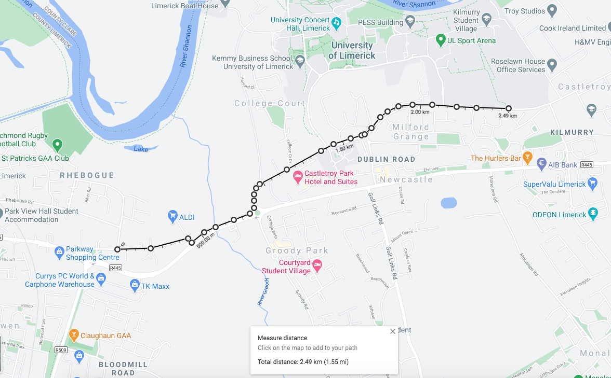

I now have the battery, controller, motor, throttle and new compartment successfully
installed. Initially, I performed a 5km test which contained a few hills and flat 
sections. The pedals are currently disconnected because I still need to get a casette.

*__Fig 1.__ The initial 5km test*

#### Positives ✅

- It is very silent!!! It's very different to the loud whine from the old Bike
- The electronics all seemed to work quite well, no problems there.
- It has enough power to pull me around on motor power alone.
- The side panels were reasonably secure

#### Negatives ❌

- The back wheel has a periodic clicking sound. This is probably from loose spokes.
- The back and front tyre are still not true, so the ride is very wobbly and bumpy.
- The battery shakes and moves quite a bit when hitting bumps.
- There is currently no casette, so that must be added.
- The power of the motor could pull me the entire way, however there were parts where
it really struggled. Adding the hall effect sensors and FOC might increase the torque
and improve the experience.
- Even though the side panels were reasonably secure when riding, they loosened quite
easily when not cycling.
- There are still gaps along the side panel seam.

#### Action points 📋

- True, balance and tighten wheels
- Secure battery in box
- Buy and install casette
- Install hall effect sensors
- Secure side panel straps
- Remove side panel seam
