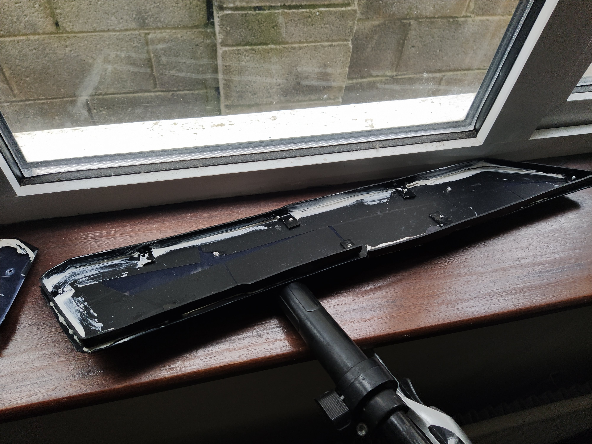
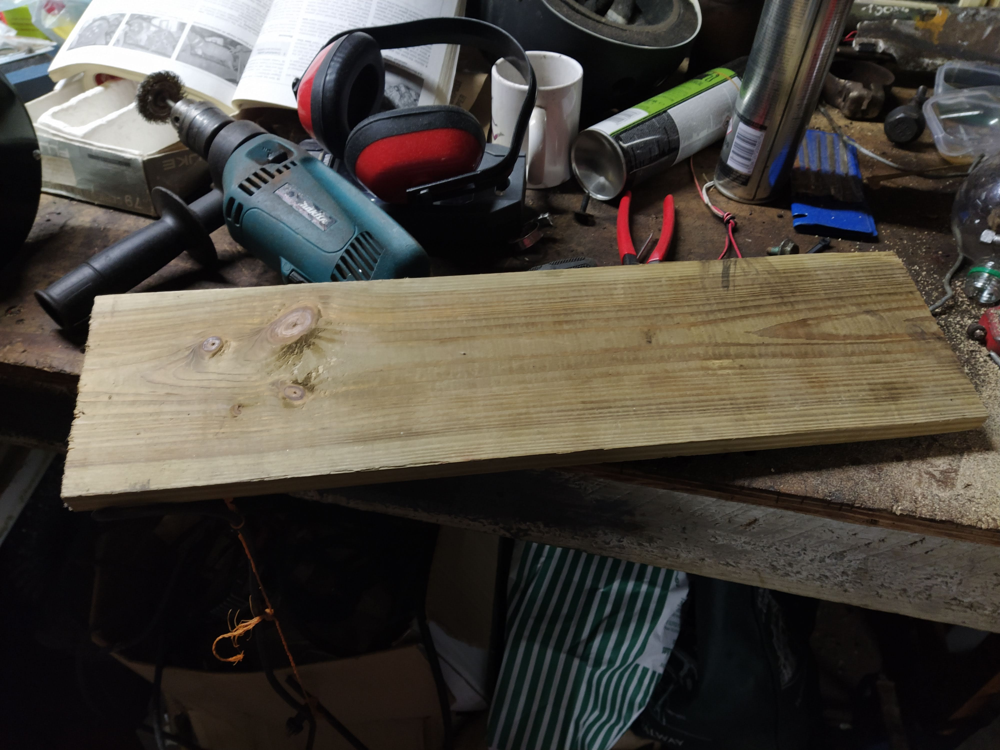
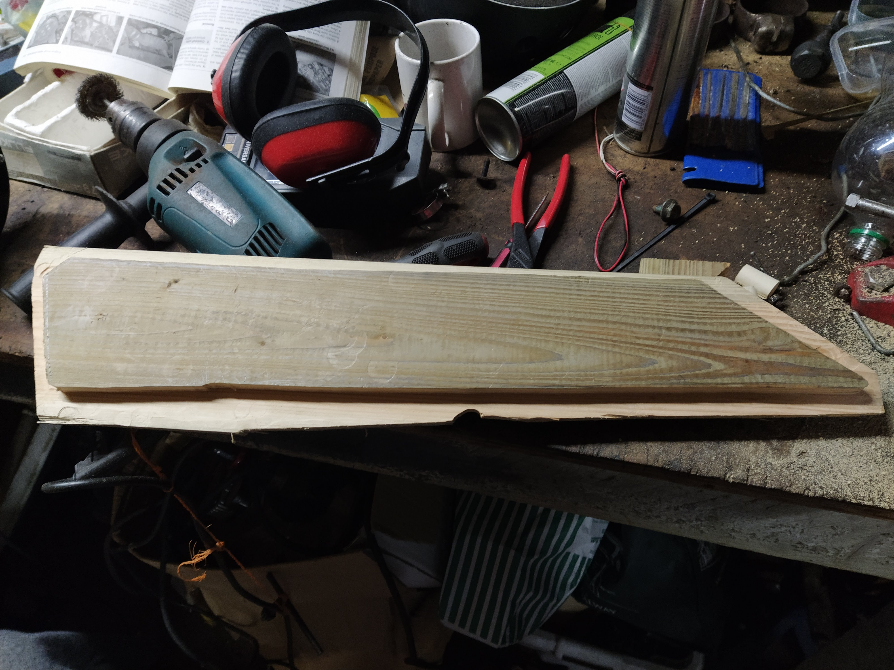
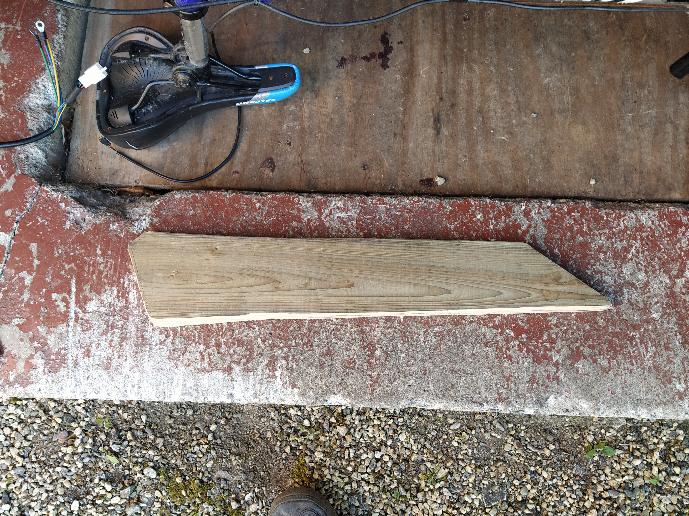
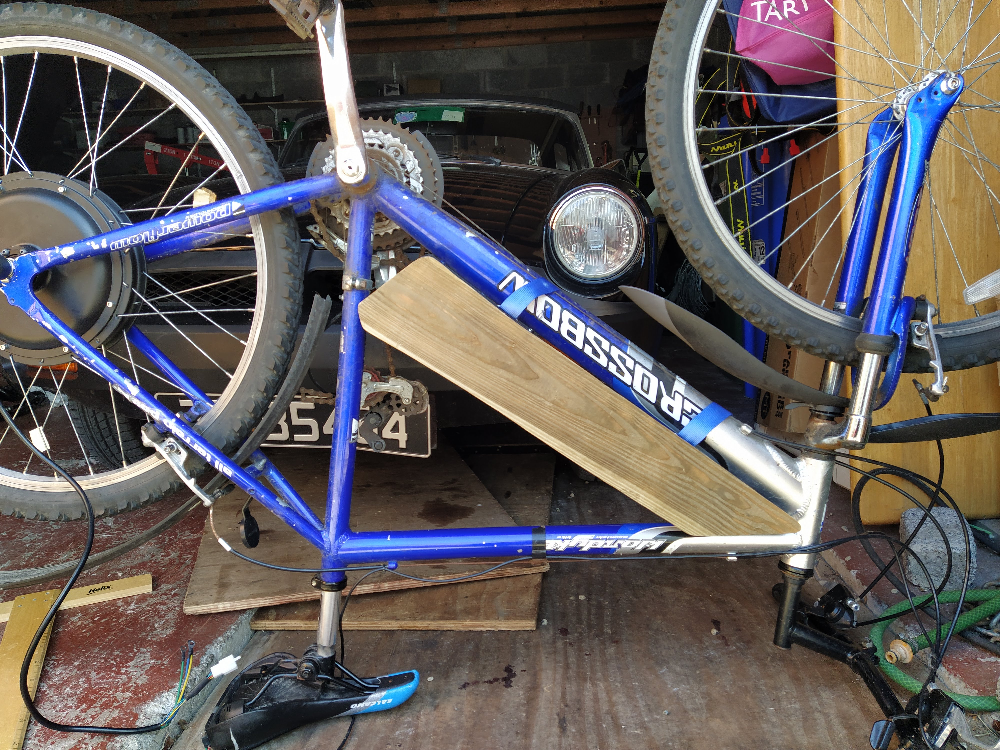
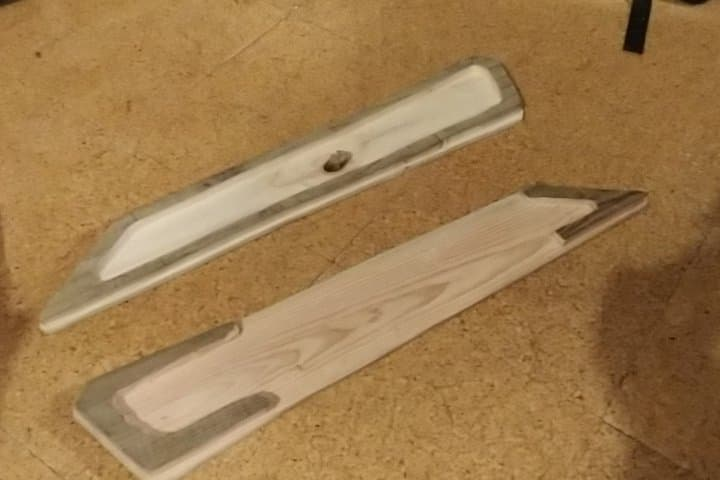
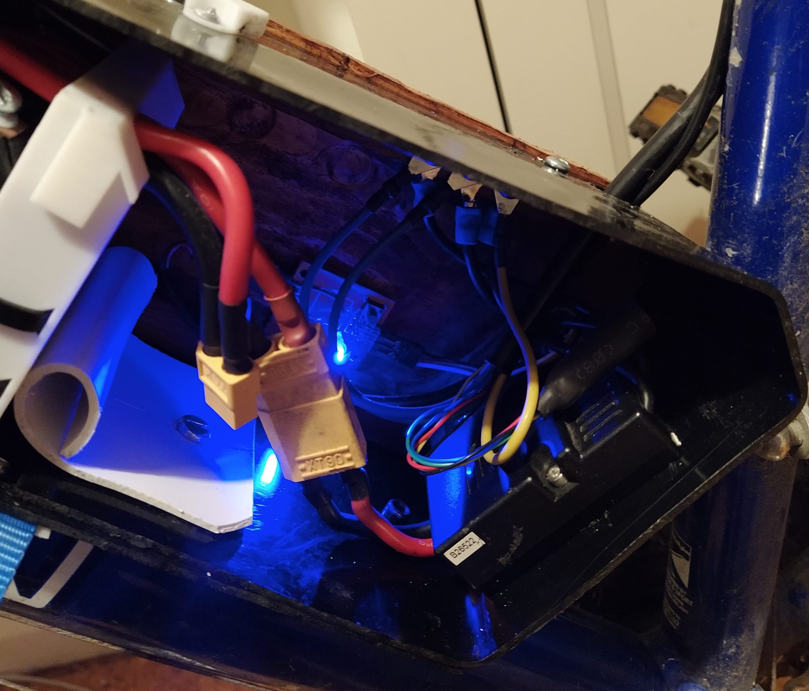

The battery and controller need a compartment to protect them from wind and rain and to
keep them secure. The old compartment had a middle section made of black PVC gutter that
was heated and formed. Each side panel was made from thin polypropylene sheets wrapped
in matte black car wrap and PVC brackets rivetted together.

*__Fig 1.__ The old panel from the compartment*

The seal on the old compartment was OK once I had sealed it with white caulk. However,
the seal was far from perfect, it looked tacky and it was very flimsy 😬 With that, a new
compartment is needed.

### 1. Design 📝

There were a few aspects of the old design that I liked. The black PVC gutter in the middle
was sturdy and worked very well. The strap mechanism for the battery made the battery easily
accessible and secure. These straps might have to be revisited at some other time, but
they're fine for now. The main eye sore and annoyance were the side panels.

Wooden side panels are the way to go. They will be made of one solid piece of wood and then
routed out to reduce weight. there will be a lip to keep the side panels in position. 
Otherwise, they'll follow the shape of the middle piece.

### 2. Build 🏗️

*__Fig 2.__ Original wood*

The first step was to take a piece of would and cut out the lip that would fit inside the 
compartment using a router.

*__Fig 3.__ The first lip cut out that slides inside the compartment*

Now the lip can be trimmed and test fit into the compartment.

*__Fig 4.__ The lip is trimmed and tested in the compartment*

The inside is then hollowed out to save on weight and create enough space for the
battery.

*__Fig 5.__ Hollowed out panels*

### 3. Install 🔩

Now the panels are made and they are ready to be installed into the bike. A little bit of dark
varnish is applied to each panel for aesthetics and then they are fitted to the compartment frame.
The panel on the right side of the bike is fixed in place using short self-tapping screws. These
screws are pre-drilled and then screwed into the lip to keep the form of the centre piece and to
maintain a sturdy panel.

*__Fig 6.__ A lick of varnish and some screws to finish it off*

The electronics are also fitted inside behind the battery. This part of the project was not very
complicated, just time consuming. I am very happy with the end result however 👌

*__Fig 7.__ The electronics inside*

