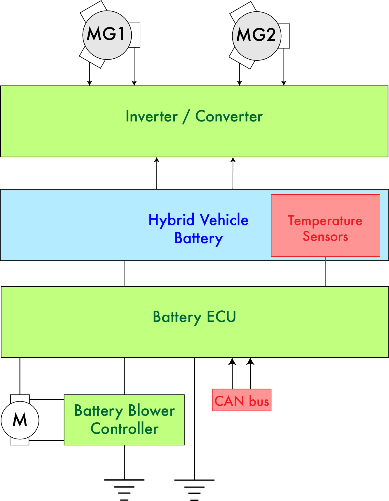
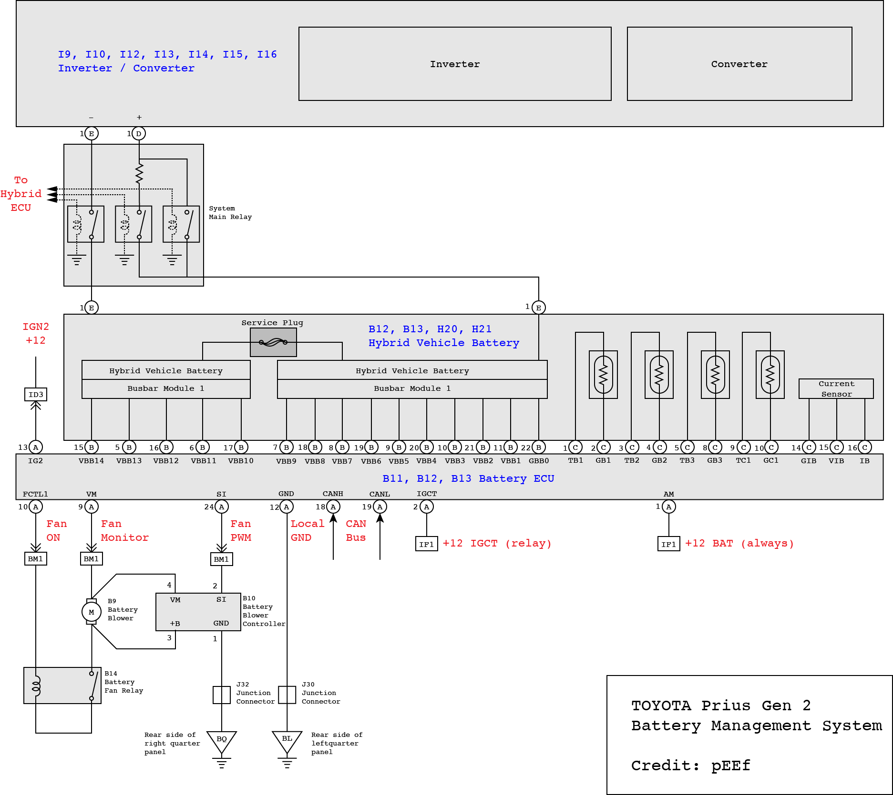
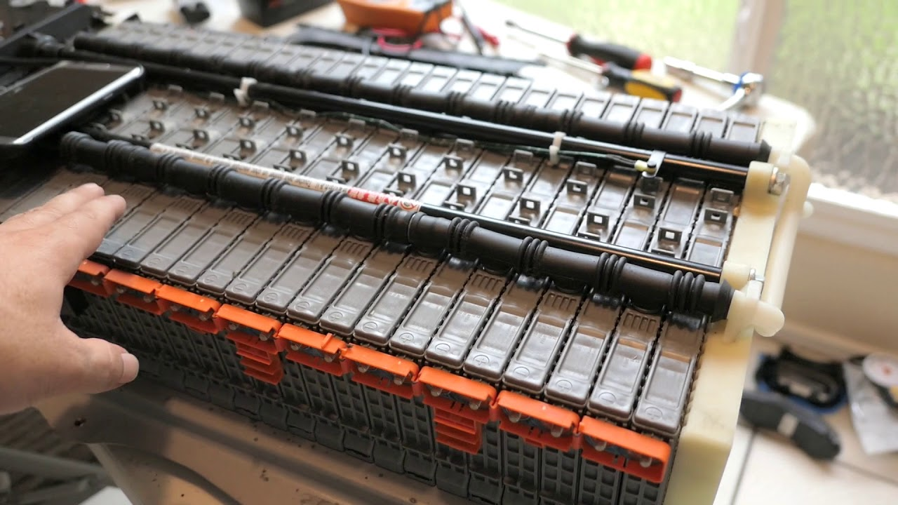
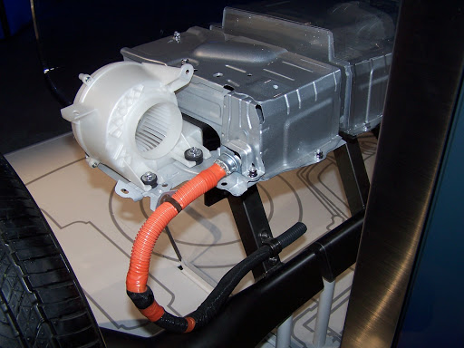

### Battery System Overview 🔋🔋🔋🔋🔌

Battery ECU teardown by pEEf: https://priuschat.com/threads/battery-ecu-secrets-and-teardown-warning-geek-content.85987/

*__Fig 1.1__ A simplified block diagram of the battery system *

- **Battery ECU** : Effectively a Battery Management System (BMS) that monitors the 
    cell voltages and controls the battery blower
- **Battery Blower** : Used to cool the battery
- **Battery Blower Controller** : Drives the battery blower motor
- **Traction Battery** : The high voltage battery that drives the car
- **Inverter / Converter** : Converts between AC and DC power for powering the motors 
    from the traction battery and charging the traction battery from the motors
- **Hybrid vehicle control ECU** : The main controller that coordinates the inverter/converter, ICE and battery

*__Fig 1.2__ A detailed block diagram of the battery system *

### Battery 🔋

- High Voltage Traction Battery

The high voltage battery (also known as the traction battery) is a 201.6V NiMH battery
composed of 28 modules (7.2V each), where each module is made of six individual 1.2-volt,
6.5 Ah Panasonic Prismatic NiMH cells. The 28 modules are connected in series to produce a total 
energy storage capacity of 1.310kWh (201.6-volts × 6.5 Ah).

    Total voltage:           201.6V
    Total energy storage:    1.31kWh
    Number modules:          28
    Module voltage:          7.2V
    Module energy:           46.8Wh
    Number cells per module: 6
    Cell voltage:            1.2V
    Cell energy:             7.8Wh

*__Fig 2.1__ The Gen 2 prius battery without it's outer casing *

- Cooling System

Passive battery cooling and heating is accomplished through the metal case of the battery 
assembly pack, while a forced air cooling system with a blower motor and ducting system 
enables active cooling of the HV battery. The blower motor is driven by a blower motor
controller which is controlled by the battery ECU.

*__Fig 2.2__ A view of the blower motor on a Gen 3 HV battery *

- Low Voltage Battery

The 12V lead acid battery in the boot of the car. The low voltage battery is charged by 
the Inverter/Converter which gets its power from the traction battery.

### Battery Management System ⚖️🔋

The Battery ECU is the main control board for the battery. This controller keeps the state 
of charge (SOC) between approximately 40 and 80 percent (shallow cycling), where the average 
SOC hovers around 60 percent, allowing about 400 Wh of useful energy storage to capture energy
The shallow cycling enables the hybrid battery to last tens of thousands of cycles, which 
translates into decades of use and in many cases more than 200,000 miles (320,000 km) of operation.

The shallow cycling means that the batteries cells do not need to be balanced. High precision
matched cells are used so that they charge and discharge at the same rate and therefore maintain
the same voltage over many cycles. Therefore the Battery ECU monitors the voltages of a group of
modules, temperature and the battery blower system.
