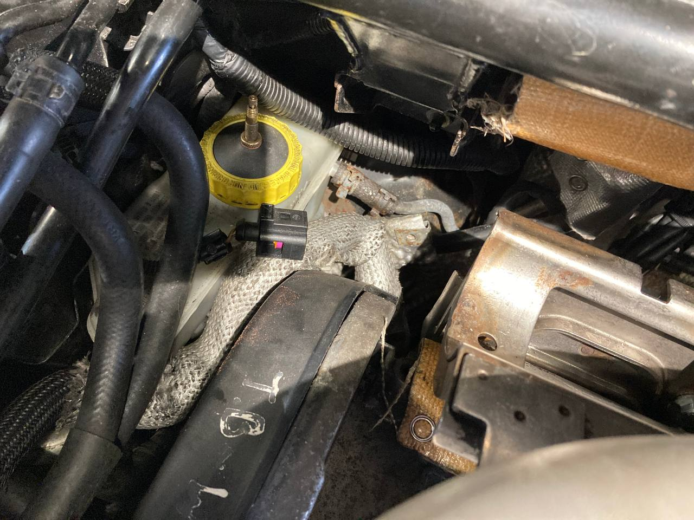

When removing the engine in my Audi TT I had to flush the coolant and power steering fluid and disconnect the clutch slave cylinder.
This meant for a lot of bleeding when I reinstalled the engine. I have had an awful time trying to bleed the braking system in the car
before so this guide documents my experience bleeding the systems.

### Cooling System Bleed

This is the easist system to bleed. 

__What you need:__

1. 5 litres of premixed G12 coolant. Alternatively you can buy 2.5 litres of antifreeze and mix it with 2.5 litres of distilled water only.
2. Optionally a funnel to help pouring the coolant in. The antifreeze should be pink in colour.

__Method:__

1. Ensure that the coolant flush valve is in its closed position.
2. Fill it until the reservoir is full with coolant.
3. Start the car and continue to fill the reservoir with coolant until it stops dropping. It's perfectly normal to see the coolant drop as soon
as you start the car.
4. Leave the car running to bring it up to temperature. You should see the coolant level drop slightly as it is brought up to temperature.
5. Turn off the car and top it up with coolant to the max on the reservoir if it is needed.

That's it! The system bleeds itself.

### Power Steering System Bleed

__What you need:__

1. 1 litre of CHF 11S or CHF 202 hydraulic fluid. It should be green in colour.
2. Optionally a funnel to help pour the fluid.

__Method:__

1. The Haynes manual says to fill the reservoir and start the car, turning the steering rack over and back until the air has cleared. I recommend another
step to prime the power steering pump with fluid first by disconnecting the serpentine belt and turning the power steering pump clockwise
by hand. I did this for about 5 minutes while continuously topping up the reservoir until it no longer dropped.
2. Start the car and let the system sit with the cap off of the reservoir. You should hear disturbing sounds from the power steering pump. It
sounds like the bearing in the pump is about the self-destruct. This is perfectly normal. Leave it to idle and watch as the power steering fluid
bubbles away. You may want to leave the cap slightly on the reservoir to prevent the fluid from splashing on your face.
3. Once the pump begins to sound normal with no lock, turn the wheels over and back. You should hear bad sounds on lock. This is more trapped air.
Continue to turn the wheels until the sound has gone. Put the cap on the power steering reservoir and that's it!

### Clutch Slave Cylinder Bleed

This was more challenging than the other systems to bleed. On the Audi TT, the clutch and brake systems share the same reservoir, mounted above
the brake master cylinder. There is a small hole to the side of the reservoir that feeds brake fluid to the clutch master cylinder.

There is a couple of unfortunate design flaws with this system:

1. The hole for the clutch master cylinder pipe is very high up in the reservoir so it requires the fluid level to be high for it to flow into it.
2. The reservoir becomes cloudy over time and it is difficult to see the brake fluid level.
3. There is a filter to prevent unwanted dirt from getting into the reservoir. This filter traps brake fluid by surface tension causing it to
look like the reservoir is full when it is not.

With these design flaws in mind let's talk about bleeding the clutch slave cylinder.

__What you need:__

1. 1 litre of dot 4 brake fluid.
2. A funnel and hose to fill the brake fluid reservoir without spilling it. The brake fluid reserviour on right hand drive cars is in an extremely
awkward position.
3. A rag or a plastic pipe to catch any of the brake fluid that escapes from the clutch slave cylinder.
4. A 9mm spanner. We also built a customer spanner with a 90 degree angle to make it easier to open and close the clutch slave cylinder bleeding
nipple but it's not an absolute requirement.

__Why bleed the clutch?__

If you've had to disconnect or replace the clutch slave cylinder for any reason you will have to bleed the clutch. If your clutch pedal has gone
to the floor you will also need to bleed the clutch slave cylinder.

Note that if your clutch pedal has not gone to the floor, you may not need to bleed the clutch slave cylinder unless the pedal feels spongy.

__Method 1:__

1. Fill the brake fluid reservoir and wait for the the fluid level to drop. Continue to add the fluid bit by bit until the level doesn't drop
anymore.
2. Locate the clutch slave cylinder. It should be accessible without removing the battery. It is located just to the left of the battery in
front of the gear linkages. You should see a small bleeding nipple on the top of the cylinder.
3. Before we start the bleeding process, it's useful to understand how the clutch works. Unlike the brake cylinder where pressure can be built
by pumping the brake pedal, the clutch pedal pressurises the system when pushed down and depressurises it when you pull it up. Because of this,
pumping the clutch doesn't do anything. 
4. Simply push the clutch pedal down once to pressurise it and then bleed the system. Your clutch pedal should stay to the floor as it needs bleeding.
5. Open the bleed nipple. You should get a lot of air along with some brake fluid.
6. Close the bleed nipple again, pull the clutch pedal up and then to the floor again. Repeat the process until the clutch returns when pushed down.

The problem with this technique is that because the only pressure introduced to the system is from the clutch pedal being pressed once, this can take
a long time. A faster method is to pressurise the brake fluid reservoir. This allows for much more fluid to flow through the system each time the
bleed nipple is opened.

If you're struggling to get the system bled with __method 1__ then have a look at this:

__Method 2:__

1. Fill the brake fluid reservoir and wait for the the fluid level to drop. Continue to add the fluid bit by bit until the level doesn't drop
anymore.
2. Pressurise the brake fluid reservoir with a brake bleeding kit like [this one](https://www.screwfix.ie/p/gunson-brake-bleeding-kit-14-piece-set/33881).
I did not have a brake bleeding kit so I cut a piece of rubber in a circle the same size as the brake reservoir cap, took an old bicycle tube valve and cut a hole
in the rubber to push the bicycle valve through it. I then tightened it on the rubber and used a bicycle pump to pump air into the brake reservoir.

